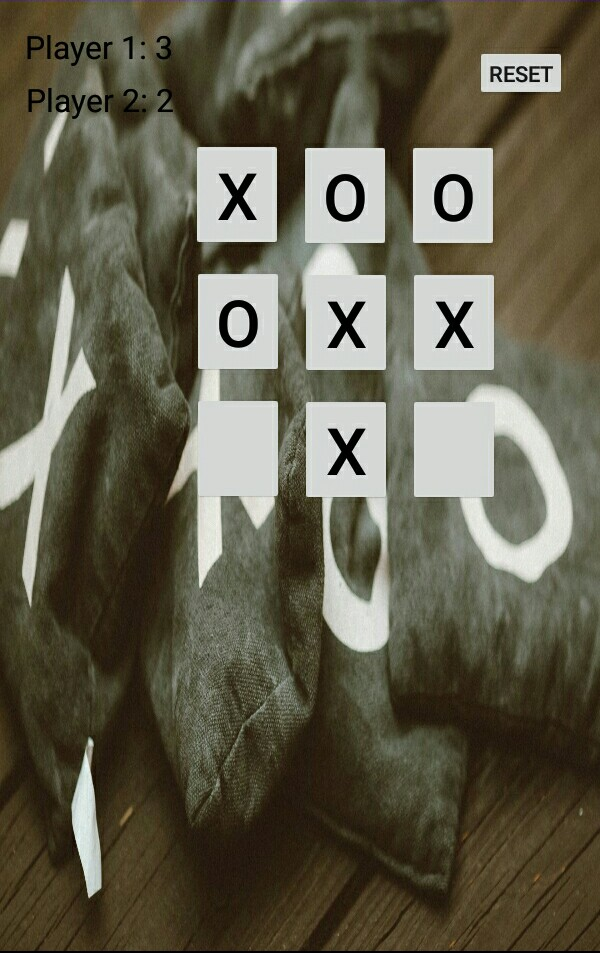

# Tic Tac Toe Android Application Game

Tic-tac-toe, or Xs and Os is a game for two players, X and O, who take turns marking the spaces in a 3×3 grid. The player who succeeds in placing three of their marks in a horizontal, vertical, or diagonal row wins the game.

## Overview
* It's an offline android game between two players.
* It has two Textview for each player to display score.
* It has 9 buttons to enter the signs of players.
* It has a reset button to reset the game and set the score for each player to zero.

## Technologies
* Java as development programming language.
* Android Studio as development environment. 

